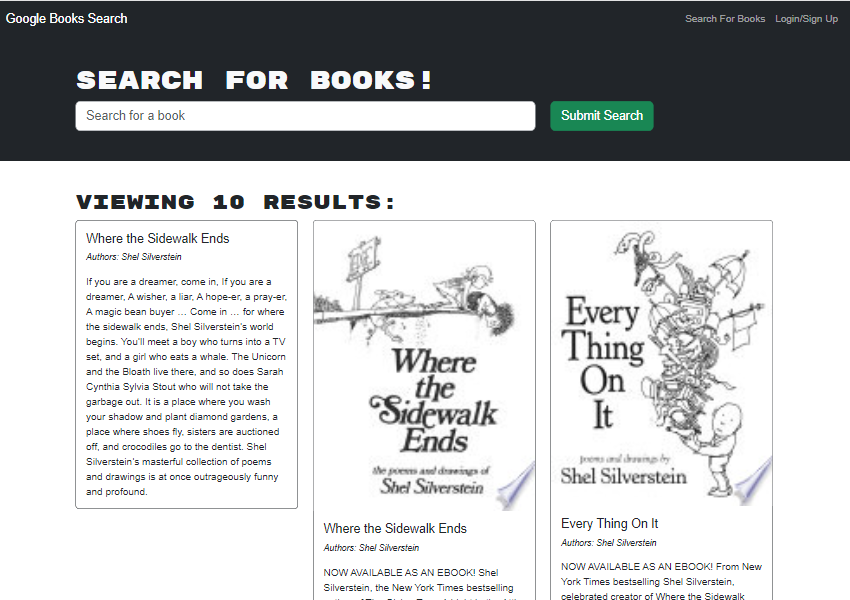
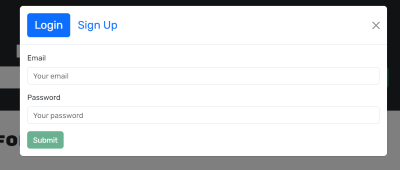
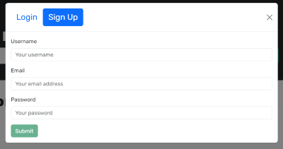
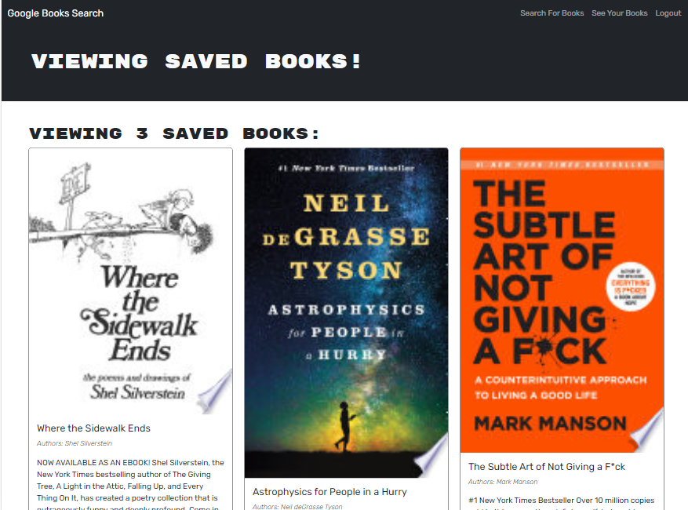

# Book Search Engine  

## Description  

This is a refactored book search engine using an Apollo server and GraphQL. The app was refactored from a RESTful API to a GraphQL API. The app allows users to search for books and save them to their account. The app is deployed to [Render](https://google-book-search-qyb8.onrender.com/). I find the free tier of Render makes loading time extremely slow.  
I had many challenges with this assignment, but I found the class activites and the documentation on Apollo server and GraphQL to be helpful. I also had a lot of help from my classmate, Wes, who helped me trouble shoot my code, helped me set up MondgoDB Atlas and deploy to Render. I also used Chat GPT to help guide me through the assignment. This one was a tough one for me. I had a lot of issues deploying, I found the documentation did not help much. Luckily my classmate had help from a tutor and was able to pass on the knowledge. The app works great now (once loaded), give it a try! 

## Table of Contents  

- [Installation](#Installation)
- [Usage](#Usage)
- [Credits](#Credits)
- [License](#License)
- [Contributing](#Contributing)
- [Tests](#Tests)
- [Questions](#Questions)

## Credits  

Book Search starter code:
* https://github.com/coding-boot-camp/solid-broccoli  

Apollo server and GraphQL documentation:
* https://www.apollographql.com/docs/apollo-server/getting-started  
* https://www.npmjs.com/package/@apollo/server  
* https://www.npmjs.com/package/apollo-server-express  
* https://www.apollographql.com/docs/apollo-server/integrations/mern/
* https://www.apollographql.com/docs/apollo-server/integrations/mern/  

React hooks-effect cleanup:
* https://legacy.reactjs.org/docs/hooks-effect.html#effects-with-cleanup  

Chat GPT:
* https://chat.openai.com/  

The activities in Bootcampspot also helped me to understand the concepts and help complete the assignment.  

Also a big thanks to my classmate, Wes, for helping me trouble shoot my code, helping me set up MondgoDB Atlas and deploy to Render.

## Installation  

N/A. No installation is required for this app. You can view the deployed app [here](https://google-book-search-qyb8.onrender.com/).  
If you choose to run it locally, you will need to do the following:
1. Clone the repo
3. In the root, run `npm i` to install all dependencies
2. Run `npm run install` to install all dependencies on server and client side
3. Run `npm run develop` to start the server
4. Open http://localhost:3000 to view it in the browser

## Usage  

The app is deployed [HERE](https://google-book-search-qyb8.onrender.com/).  
When you open the app, you will see the homepage, where you can search for books even if you are not logged in. You cannot save books unless you are logged in.  

To save books, you will need to sign up or login. You can do so by clicking on the `Login` or `Signup` links in the navigation bar.  
  
  
Once you are logged in, you can save books by clicking on the `Save this Book!` button. You can view your saved books by clicking on the `See Your Books` link in the navigation bar.  
  
To remove a book from your saved books, click on the `Delete this Book!` button.

## License

This project is covered under the MIT License. For more information [click here](https://opensource.org/license/mit/).

## Contributing

Create an issue in GitHub [repo](https://github.com/milena-allaway/book_search/issues)

## Tests

N/A. No tests are included in this app.

## Questions

For any questions or feedback, please contact me via:
- GitHub: [milena-allaway](https://github.com/milena-allaway)
- Email: [milenawheatcroft@gmail.com](mailto:milenawheatcroft@gmail.com)

***

Made with ❤️ by Milena Allaway 2023